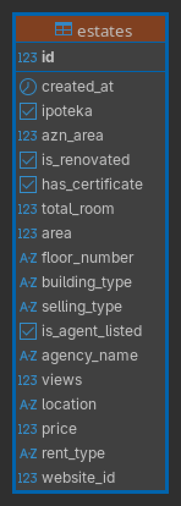

# About the Project
This project is about the Real Estate market of Azerbaijan. The data is scraped from the most used (and probably the only one everyone knows) website **bina.az**, tidied (According to Tidyverse schema) and stored in PostgreSQL, statistical and data analysis are made in R Tidyverse packages.
# About the Data
As of writing there are total **24413** rows of data in the database. See the below table for the explanations of column variables.

<table>
  <tr>
    <td valign="top" width="350">
      
    </td>
    <td valign="top">
      <h2>Field Definitions</h2>
      <ul>
        <li><b>id:</b> (Key) Unique key identifier for each row.</li>
        <li><b>created_at:</b> (Time) When this specific row of data was scraped from the website.</li>
        <li><b>ipoteka:</b> (Boolean) Translates into Mortgage. Whether if Mortgage is avaliable or not. </li>
        <li><b>azn_area:</b> (Float) Price in AZN per square meter of the estate.</li>
        <li><b>is_renovated:</b> (Boolean) Whether if the estate has been renovated recently.</li>
        <li><b>has_certificate:</b> (Boolean) Refers to the presence of the <b>Çıxarış</b> (official document about the ownership of the estate).</li>
        <li><b>total_room:</b> (Int) Number of the rooms of the estate.</li>
        <li><b>area:</b>(Float) Area in square meters of the estate.</li>
        <li><b>floor_number:</b> (Text) The floor of the Apartment.</li>
        <li><b>building_type:</b>(Text) What kind of estate the listing is. It can be land, office, apartment, country house etc.</li>
        <li><b>selling_type:</b> Distinguishes between "New Building" (Yeni tikili), "Old Building" (Köhnə tikili), or Land/Office.</li>
        <li><b>is_agent_listed:</b> (Boolean) 1 if listed by a real estate agency, N/A otherwise.</li>
        <li><b>agency_name</b>(text) Name of the Agency. If not agent listed, value is N/A.</li>
        <li><b>views:</b>(Int) The number of views the listing had in the website.</li>
        <li><b>price:</b> (Int) Price in AZN of the estate.</li>
        <li><b>rent_type:</b> (Text) Duration of rent (daily vs. monthly) or N/A for sales.</li>
        <li><b>website_id:</b> (Int) The unique identifier from the source website.</li>
      </ul>
    </td>
  </tr>
</table>

### Here is the first 5 row of the database:

| id|created_at          |ipoteka |  azn_area|is_renovated |has_certificate | total_room|  area|floor_number |building_type     |selling_type |is_agent_listed |agency_name | views|location                                            |   price|rent_type | website_id|
|--:|:-------------------|:-------|---------:|:------------|:---------------|----------:|-----:|:------------|:-----------------|:------------|:---------------|:-----------|-----:|:---------------------------------------------------|-------:|:---------|----------:|
|  1|2025-11-16 18:51:22 |TRUE    | 3353.4483|TRUE         |TRUE            |          3| 116.0|12 / 15      |Yeni tikili       |Satış        |FALSE           |N/A         |  1628|Bəşir Səfəroğlu küçəsi 5, mənzil 61, 476-ci məhəllə |  389000|N/A       |    5620010|
|  2|2025-11-16 18:51:25 |NA      | 6889.7638|FALSE        |FALSE           |         NA| 508.0|NA           |Obyekt            |Satış        |FALSE           |N/A         |  1048|Ağ şəhər.                                           | 3500000|N/A       |    5592911|
|  3|2025-11-16 18:51:27 |TRUE    | 5015.0000|TRUE         |FALSE           |          2| 102.0|2 / 7        |Yeni tikili       |Satış        |TRUE            |N/A         |   174|Sea Breeze                                          |  511530|N/A       |    5505220|
|  4|2025-11-16 18:51:30 |NA      |  898.1481|FALSE        |TRUE            |          8| 540.0|NA           |Həyət evi/Bağ evi |Satış        |TRUE            |N/A         |  4490|Salyan şossesi                                      |  485000|N/A       |    5292754|
|  5|2025-11-16 18:51:33 |TRUE    | 3740.0000|FALSE        |FALSE           |          2| 109.5|2 / 7        |Yeni tikili       |Satış        |TRUE            |N/A         |   264|Sea Breeze                                          |  409530|N/A       |    5552043|
> 

# Data Pipeline
1) Data is scraped from the  **bina.az** website using BeautifulSoup and Selenium.
2) Data is tidied (Tidyverse) and stored in PostgreSQL database
3) If needed, The data is transformed using Dplyr
4) At last the statistical analysis or data visualization starts
5) The results are published in README.md

